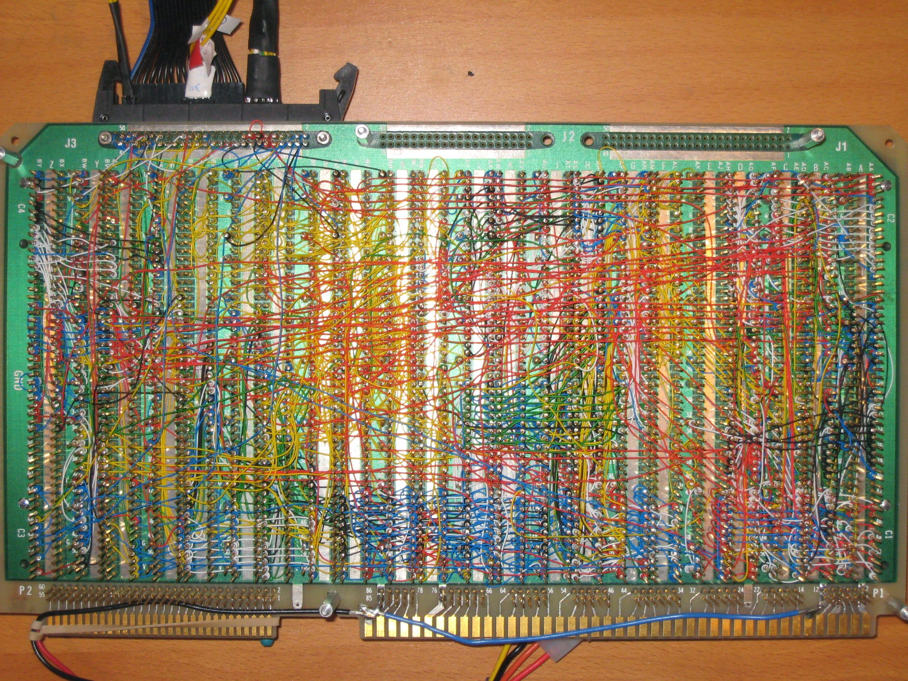
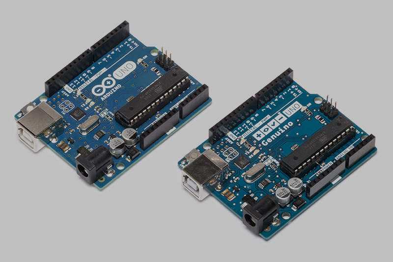
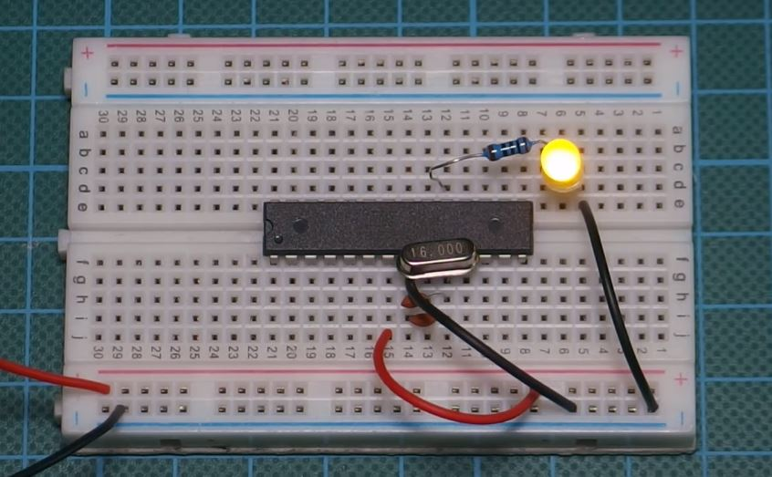

# DoPCB / Day 2

---

## DESIGNING PCBs (14:00–16:00)

"today we will design a PCB"

---

### 4-step process

- physical prototyping ( e.g breadboard )
- schematics
- symbols to footprints
- PCB design

---

---

#### ATmega328P barebone ( as used in Arduino UNO )

[Arduino/Genuino UNO](https://www.arduino.cc/en/Main/arduinoBoardUno&gt)

---

### physical protyping
 

 
- breadboard
- perfboard
- datasheets + *reference designs* ( e.g [ATmega328P](http://ww1.microchip.com/downloads/en/DeviceDoc/Atmel-7810-Automotive-Microcontrollers-ATmega328P_Datasheet.pdf) + [Arduino(TM) UNO Rev3](https://content.arduino.cc/assets/UNO-TH_Rev3e_sch.pdf) )

---

### schematics

- place components
- connect components
- labels
- annotate + Design Rule Check (DRC) + power flags
- again: use datasheets + *reference designs*
- @maybe add custom components ( e.g [snapeda](https://www.snapeda.com) + [Import Steps for KiCad (V4 and later)](https://www.snapeda.com/about/import/#KiCad5))
- @maybe hierarchical sheets

---

### symbols to footprints

- and again: use datasheets + *reference designs*
- excursion: packages
- [digikey](https://www.digikey.de)
- [arrow](https://www.arrow.com)

#### packages

usually specific functional components have their own package description systems:

- SMD Resistor Package ( e.g 0805, 0603, 0402 ) #SMD
- Dual In-line Package (DIP) #THT
- Small-Outline Package (SOP) + Small-outline Integrated Circuit (SOIC) #SMD
- Thin Quad Flat Package (TQFP) #SMD
- Quad Flat No-leads (QNF) #SMD #EVIL

see [List of integrated circuit packaging types](https://en.wikipedia.org/wiki/List_of_integrated_circuit_packaging_types)

---

### PCB design

- layers ( @maybe 2-layer- vs 4-layer-designs )
- routing traces ( + semi-auto routing ) + ratsnest
- Design Rule Check (DRC)
- edge cuts + *mounting holes* or PCB in context ( + 3D view )
- ground fill + signal planes
- @maybe add custom components
- @maybe adding custom silkscreen layers

---

### Custom Components

- either create your own or find it in a database
    - create your own symbol with *Symbol Editor*
    - create your own footrpint with *Footprint Editor*
- there are many symbol+footprint libraries or individual symbols + footprints available on the internet e.g:
    - [DigiKey KiCad Library](https://github.com/Digi-Key/digikey-kicad-library)
    - [SnapEDA](https://www.snapeda.com)
    - ***ALWAYS MAKE SURE TO CONSOLUT THE COMPONENTS DATASHEET!!!***

---

#### adding custom components

- add `library` folder to project folder
- copy symbol + footprint files to folder
- `.lib` symbols + `.kicad_mod` footprints  + `.mod` for legacy footprint files
- `.mod` can be converted to `.kicad_mod` with *Symbol Editor*

---

##### symbol

- in *KiCad* application open `Preferences > Manage Symbol Libraries…`
- choose tab `Project Specific Libraries` 
- add new entry with `+` icon
- choose `Nickname`
- choose `Library Path` by clicking on folder and navigating to `.lib` file 
    - @hint replace absolute library path with `${KIPRJMOD}` to make path relative ( e.g `${KIPRJMOD}/library/STX-3680-5NB.lib` )
    - …
- symbol is now available

---

##### footprint

- in *KiCad* application open `Preferences > Manage Footprint Libraries…`
- choose tab `Project Specific Libraries` 
- add new entry with `+` icon
- choose `Nickname`
- choose `Library Path` by clicking on folder and navigating to `.lib` file 
    - @hint replace absolute library path with `${KIPRJMOD}` to make path relative ( e.g `${KIPRJMOD}/library/STX-3680-5NB.lib` )
    - …
- footprint is now available

---

### assignment

rebuild the design yourself + maybe add one or to things ( e.g LEDs or buttons )

