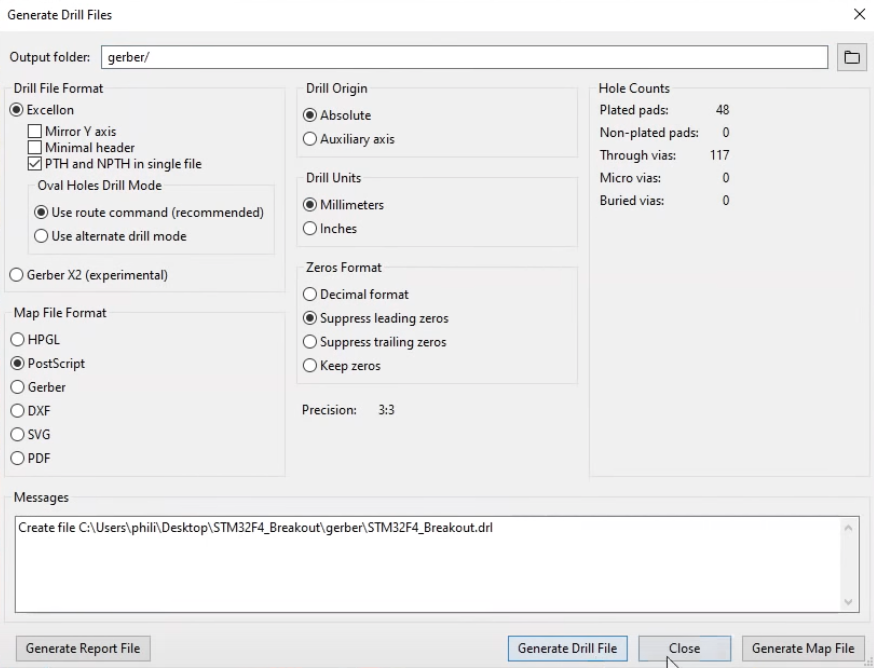

# DoPCB / Day 3

---

## PCB PRODUCTION (10:00–11:00)

"today we will look into the production of PCBs"

---

### PCB production facilities 

( and my opinion on them )

- [Aisler](https://go.aisler.net/)
- [PCBWay](https://www.pcbway.com)
- [OSH Park](https://oshpark.com)
- [JLCPCB](https://jlcpcb.com)

---

` `

---

### alternatives methods of production

- CNC mills ( e.g [Genmitsu 3018-PROVer Semi Assembled CNC Router Kit](https://www.sainsmart.com/products/sainsmart-genmitsu-cnc-router-3018-prover-kit) )
- [How to Etch a PCB](https://www.instructables.com/How-to-Etch-a-PCB/)

---

### automatic versus manual assembly

- size
- time
- cost

---

### SMD soldering

what if have to manually solder SMD components?

- *Werkstatt für Elektronische Experimente* ( run by Felix Fisgus )
- (my) *standard* soldering setup
    - soldering iron ( 350°C )
    - chisel-shaped solder tip
    - fine solder lead
    - flux
    - solder wig
    - magnification ( e.g microscope )
    - multimeter
    - clipper + tweezers
- reflow soldering
    - solder paste
    - SMD stencils

---

### preparing a design for automatic PCB Assembly

- change all components to SMT/SMD
- spec'ing components
    - find component at JLCPCB
    - [JLCPCB SMT Parts Library](https://jlcpcb.com/parts)
    - add JLCPCB Part number 
- reading datasheets

#### packages

usually specific functional components have their own package description systems:

- SMD Resistor Package ( e.g 0805, 0603, 0402 ) #SMD
- Dual In-line Package (DIP) #THT
- Small-Outline Package (SOP) + Small-outline Integrated Circuit (SOIC) #SMD
- Thin Quad Flat Package (TQFP) #SMD
- Quad Flat No-leads (QNF) #SMD #EVIL

see [List of integrated circuit packaging types](https://en.wikipedia.org/wiki/List_of_integrated_circuit_packaging_types)

---

` `

---

### PCB Assembly with JLCPCB

- Gerber file :: for PCB production
- Bill of Materials (BOM) file :: for SMT Assembly
- Component Placement List (CPL) + Pick & Place (PNP) files :: for SMT Assembly machines

see [JLCPCB SMT Assembly Made Easy](https://jlcpcb.com/smt-assembly) for reference and check tutorial [Phil’s Lab: KiCad STM32 Hardware Design and JLCPCB Assembly](https://youtu.be/t5phi3nT8OU?t=8320).

---

#### generate GERBER

- add `gerber` folder
- click `Generate Drill Files…`
- check `DRILL` settings 
- click `Generate Drill File`
- check `PLOT` settings
- click `Plot`
- ZIP files

---

##### Drill File Settings

---

##### Gerber File Settings

---

#### generate BOM

- generate BOM in *Schematic Editor* ( `.csv` ) with plugin `bom_csv_gouped_by_value_with_fp`
- update table to conform to *example table*:
    - delete *header* rows
    - rename `Ref` to `Designator`
    - rename `Value` to `Comment`
    - delete `CmpName`
    - delete `Description`
    - delete `Vendor`
    - delete `Qnty` (???)
    - add column `JLCPCB Part #`
    - order columns: `Comment`, `Designator`, `Footprint` and `JLCPCB Part #`
    - remove parts that are not assembled
- add JLCPCB Part number from [JLCPCB SMT Parts Library](https://jlcpcb.com/parts)

---

#### generate CPL

- generate table with `File > Fabrication Outputs > File Postion (.pos) File`
- check `FOOTPRINT` settings
- update table to conform to *example table*:
    - rename `Ref` to `Designator`
    - rename `Val` to `Value`
    - delete `Package`
    - rename `PosX` to `Mid X`
    - rename `PosY` to `Mid Y`
    - rename `Rot` to `Rotation`
    - rename `Side` to `Layer`

---

##### Gerber File Settings

---

#### upload to JLCPCB

- upload Gerber ZIP
- select `SMT Assembly`
- upload `BOM` + `CPL`
- check parts
- check rotation + placement ( change `CPL` file if necessary )

---

### assignment

create an SMD version of the *ATmega328P Barebone* and spec all components at JLCPCB

