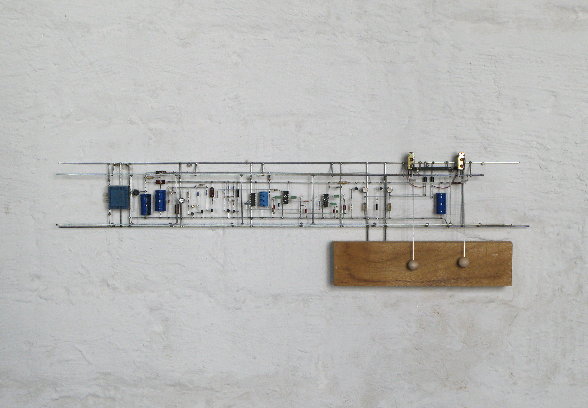

# DoPCB / Day 4

---

## ARTISTIC PCBs (10:00–12:00)

"today we will look into non-normal PCBs"

---

### examples

- [Teenage Engineering](https://teenage.engineering)
- [Yuri Suzuki](https://www.yurisuzuki.com)
- [Gij Gieskes](https://www.gieskes.nl)
- [Tristan Perich](http://www.tristanperich.com)
- (TBC)

---

[Teenage Engineering: OP Lab](https://teenage.engineering/products/oplab)

---

[Yuri Suzuki: Tubemapradio](https://www.yurisuzuki.com/artist/tube-map-radi)

---

[Gij Gieskes: 2548026E_Y116-200310](http://gijs.gieskes.nl/j@lcexpress+/?item=2548026E_Y116-200310)

---

[Tristan Perich: Noise Patterns](https://www.physicaleditions.com/tristan_perich/noise_patterns)

---

[Tristan Perich: 1-BIT Symphony](http://www.1bitsymphony.com) #no_pcb

---

[Peter Vogel: Holzklang](https://www.petervogel-heritage.de/holzklang/) #no_pcb

---

#### technique

- silkscreen layer
- see-through designs
- non-orthogonal
- (TBC)

---

### assignment

research intended and unintended *beautiful*, *ugly*, artistic or interesting PCBs ( or details ) and add them to [Artistic PCB Recherche](http://dm-hb.de/dopcb-recherche) document.